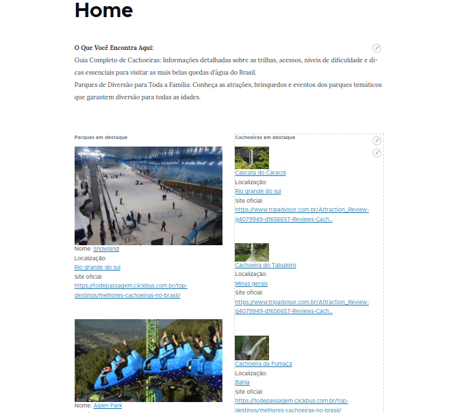

# Projeto Guia de Parques e Cachoeiras

## Instalação

### System Requirements

Você precisará ter esses ítens instalados em seu computador local:

- [Composer](https://getcomposer.org/)
- [Docker](https://www.docker.com/)
- [Lando](https://docs.lando.dev/)

### Configuração local

Depois de instalar o lando, siga estes passos:

- Primeiro, faça o clone deste projeto em seu computador local:
sh
> git clone git@github.com:bryant091/desafioFinal2024.git

- Entre na pasta do projeto:
sh
> cd MY-DRUPAL

- Inicie os containeres em seu ambiente local.
sh
> lando start

- Instale as dependencias.
sh
> lando composer install

- Importe o banco de dados
sh
> lando drush sql:cli < <extract-path>/database.sql

- Copie os arquivos para a pasta files do seu site local
sh
> mv <extract-path>/docroot/sites/default/files docroot/sites/default/files

- Limpe os caches
sh
> lando drush cache:rebuild

Seu ambiente local de desenvolvimento está pronto!